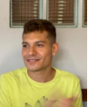

# Projeto Ri Happy - Grupo 4

## Introdução

Este repositório é designado ao Grupo 4 da matéria de arquitetura e desenho de software orientado pela professora Milene Serrano.

## Tecnologias

## Servidor Local

Para utilização do docsify utilize os seguintes comandos abaixo:

A geração do site estático é realizada utilizando o [docsify](https://docsify.js.org/).

```shell
"Docsify generates your documentation website on the fly. Unlike GitBook, it does not generate static html files. Instead, it smartly loads and parses your Markdown files and displays them as a website. To start using it, all you need to do is create an index.html and deploy it on GitHub Pages."
```

### Instalando o docsify

Execute o comando:

```shell
npm i docsify-cli -g
```

### Executando localmente

Para iniciar o site localmente, utilize o comando:

```shell
docsify serve ./docs
```

## Integrantes

| |Matrícula | Aluno |
|:--:|:--:|:--:|
|| 20/0057227 | Caio Vitor Carneiro |
| | 19/0042432 | Felipe Alef |
| | 19/0088745 | Iago de Paula |
| | 19/0089792 | Joao Victor Correia |
| | 18/0105051 | Lívia Rodrigues Reis  |
| | 19/0093196 | Mateus Caltabiano |
| | 19/0093480 | Matheus Soares |
||17/0122310 | Matheus Salim de Oliveira |
| | 18/0067265 | Pedro Daia Cardoso |
| | 19/0094486 | Pedro Henrique Nogueira  |
| | 20/2017503 | Wildemberg Sales da Silva Junior |
