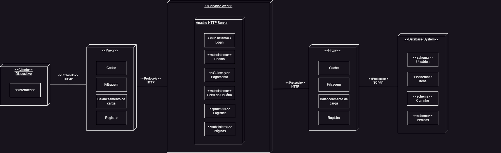
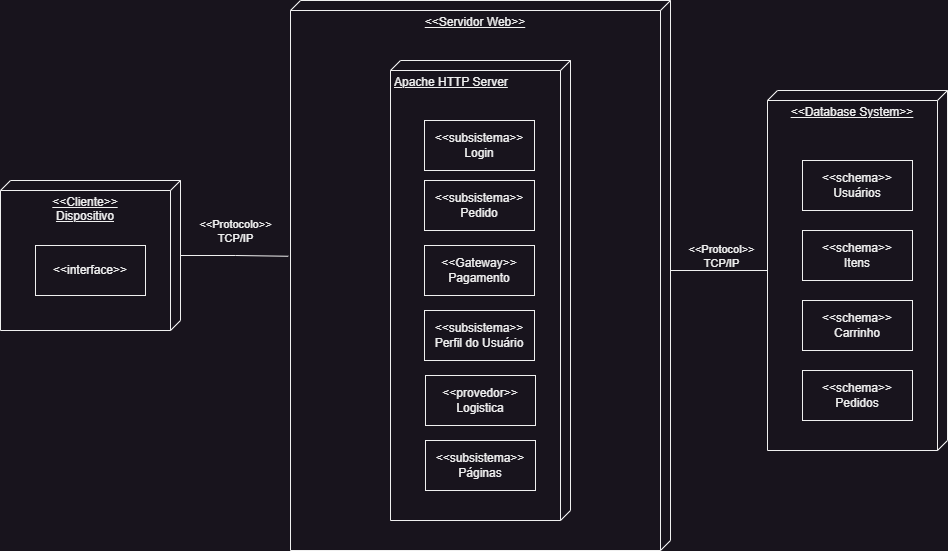
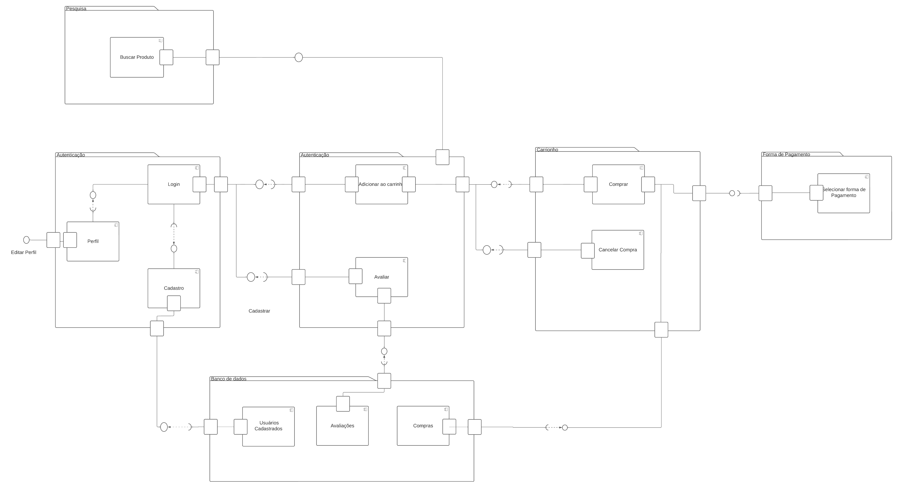

# Documento de Arquitetura de Software - DAS

## 1. Introdução
### 1.1 Finalidade
O propósito deste Documento de Arquitetura de Software (DAS) é fornecer uma visão abrangente da arquitetura de um sistema de aplicação RI-Happy. O DAS descreve as decisões arquiteturais e diretrizes adotadas para garantir um design eficiente, escalável e seguro para a plataforma.

O objetivo é compreender e documentar a estrutura e os componentes do sistema, bem como as interações entre eles. O DAS irá detalhar a arquitetura do sistema, incluindo o fluxo de informações, a organização dos componentes e os serviços oferecidos.

### 1.2 Escopo

O principal objetivo é compreender e documentar o fluxo completo, desde o cadastro na plataforma até a visualização, compra e pagamento de produtos pelos compradores da RI-Happy. Para isso, serão analisadas as etapas-chave, como criação de conta de usuário, preenchimento de informações pessoais, busca e visualização de produtos, adição ao carrinho de compras, seleção de opções (como tamanho ou cor), finalização do pedido e processamento de pagamentos.

### 1.3 Visão Geral

DAS apresentará a arquitetura do perfil do comprador, descrevendo como são coletadas e armazenadas as informações pessoais, preferências de compra e histórico de transações. Será abordada a personalização da experiência de compra com base no perfil do comprador, como recomendações de produtos relevantes e ofertas personalizadas.

O documento também fornecerá uma visão geral dos componentes e serviços envolvidos, como gerenciamento de produtos, catálogo, carrinho de compras, integração com sistemas de pagamento, autenticação de usuários e processamento de pedidos.

## 2. Representação Arquitetural

Para representar a arquitetura, utilizaremos várias visões arquiteturais que nos fornecem diferentes perspectivas do sistema. As visões selecionadas para este projeto são:

1. Visão Lógica: Essa visão representa a estrutura interna do sistema, incluindo os principais componentes lógicos e suas relações. Ela contém elementos de modelo, como diagramas de classes, diagramas de pacotes e diagramas de componentes, que descrevem as entidades, classes, interfaces e dependências que compõem a arquitetura lógica do sistema.
Na visão lógica do sistema, serão utilizados os seguintes elementos de modelo: diagrama de classe, diagrama de pacote e diagrama de estado.

    > Diagrama de Classe: Esse diagrama representa as classes do sistema e suas relações, fornecendo uma visão estática da estrutura interna do software. Ele mostra as entidades (classes), seus atributos, métodos e os relacionamentos entre elas. O diagrama de classe é útil para entender a organização e a hierarquia das classes, bem como as associações, heranças e dependências entre elas.

    > Diagrama de Pacote: O diagrama de pacote é usado para agrupar elementos relacionados do sistema em pacotes lógicos. Ele ajuda a visualizar a estrutura de organização do software, mostrando como as classes e outros elementos são agrupados em módulos ou pacotes. Esse diagrama é útil para entender a modularidade e a divisão de responsabilidades no sistema.

    > Diagrama de Estado: O diagrama de estado descreve o comportamento interno de uma classe ou de um objeto, representando os diferentes estados que um objeto pode assumir e as transições entre esses estados. Ele é usado para modelar o ciclo de vida de um objeto e os eventos que podem ocorrer para alterar seu estado. Esse diagrama é útil para entender o comportamento dinâmico do sistema e como as classes respondem a diferentes eventos ou estímulos.

2. Visão de Processo: Essa visão descreve a divisão do sistema em processos ou threads, identificando como as diferentes partes do sistema são executadas e se comunicam. Ela contém elementos de modelo, como diagramas de sequência, diagramas de colaboração e diagramas de comunicação, que mostram a troca de mensagens e o fluxo de controle entre os processos do sistema.

3. Visão de Implantação: Essa visão descreve a infraestrutura física necessária para implantar o sistema, incluindo servidores, redes, dispositivos de armazenamento e outros recursos. Ela contém elementos de modelo, como diagramas de implantação, que representam a configuração dos componentes do sistema nos ambientes de produção.

4. Visão de Implementação: Essa visão descreve os detalhes de implementação do sistema, incluindo as tecnologias, linguagens de programação e frameworks utilizados. Ela contém elementos de modelo, como diagramas de classes detalhados, que mostram como as classes e componentes são implementados e interagem entre si.

Cada visão possui seus próprios conjuntos de elementos de modelo e representa uma perspectiva específica da arquitetura do sistema. Em conjunto, essas visões nos permitem compreender a estrutura, o comportamento e as interações do sistema de forma abrangente, auxiliando no desenvolvimento, na manutenção e na evolução do software.

## 3. Metas Arquiteturais e Restrições da Arquitetura
### 3.1 Metas 
A seguir é possivel ver os objetivos do software.

| Categoria | Metas            | 
| ------ | -------------------- | 
|Segurança e confiabilidade|A aplicação tem a responsabilidade de assegurar a proteção dos dados sensíveis dos usuários, garantindo sua confidencialidade. Qualquer falha ou erro deve ser prontamente comunicado ao usuário. Além disso, o sistema deve fornecer a funcionalidade de autenticação, onde cada usuário é identificado de forma exclusiva por meio de um endereço de e-mail e uma senha.|------|
| Portabilidade e suportabilidade  |  O usuário deve conseguir acessar o portal a partir de qualquer dispositivo com conexão a internet.  |
| Acessibilidade | O portal deve fornecer assistência aos usuários com necessidades especiais. |
| Responsividade | As páginas devem trocar a resolução de acordo com o tamanho da tela do usuário. | 

### 3.2 Restrições 

| Categoria | Restrições             | 
| ------ | -------------------- | 
|Conectividade | O usuário tem que estar conectado à internet durante todo o período de utilização do portal e ter acesso a um navegador web.|
| Idioma  | O usuário deve poder escolher qual o idioma que mais facilita a compreensão das funcionalidade do portal.  |

## 4. Visões 
### 4.1 Visão Logica 
### 4.1.1 Diagrama de Classe

<iframe height="600" width="700" src="https://unbarqdsw2023-1.github.io/2023.1_G4_ProjetoRiHappy/#/Modelagem/2.1.1.1.DiagramadeClasses"></iframe>

### 4.1.2 Diagrama de Pacote

<iframe height="600" width="700" src="https://unbarqdsw2023-1.github.io/2023.1_G4_ProjetoRiHappy/#/Modelagem/2.1.1.1.DiagramadeClasses"></iframe>

### 4.1.3 Diagrama de Estado 

<iframe height="600" width="700" src="https://unbarqdsw2023-1.github.io/2023.1_G4_ProjetoRiHappy/#/Modelagem/2.1.2.1DiagramaDeSequencia"></iframe>

### 4.2 Visão de Processo 

### 4.1.4 Diagrama de Sequência 

<iframe height="600" width="700" src="https://unbarqdsw2023-1.github.io/2023.1_G4_ProjetoRiHappy/#/Modelagem/2.1.2.2.DiagramadeEstados"></iframe>

### 4.3 Visão de Implantação

#### 4.3.1 Sobre

Um diagrama de implantação, ou diagrama de deployment, é um tipo de diagrama de arquitetura que representa a distribuição física dos componentes de um sistema de software em um ambiente de implantação. Ele descreve como os elementos de software e hardware são configurados e interconectados em um ambiente real.

Um diagrama de implantação é usado para visualizar a topologia da implantação de um sistema, mostrando os nós de hardware (como servidores, computadores ou dispositivos) e os componentes de software (como aplicativos, serviços ou bancos de dados) que residem nesses nós. Ele também pode mostrar as conexões de rede, protocolos de comunicação, portas e outros detalhes relevantes para a implantação.

#### 4.3.2 Diagrama de implantação

Diagrama de implantação versão 2

Fonte: Matheus Soares

Diagrama de implantação versão 1

Fonte: Matheus Soares

### 4.4 Visão de implementação

#### 4.4.1 Sobre

A implementação do Sistema de Arquitetura Distribuída (DAS) é um processo essencial para a construção de sistemas robustos e escaláveis. A abordagem distribuída permite que diferentes componentes e serviços sejam executados em diferentes nós de rede, facilitando a escalabilidade horizontal e a resiliência. Neste texto, discutiremos a visão de implementação do DAS, bem como apresentaremos um diagrama de componentes que ilustra as interações entre os diferentes elementos do sistema.

O diagrama de componentes é uma representação visual da estrutura e das interações dos componentes de um sistema. Ele é uma das diversas notações utilizadas na modelagem de sistemas e arquiteturas de software, permitindo a visualização das relações e dependências entre os componentes que compõem um sistema.

#### 4.4.2 Diagrama de Componentes

## 5. Tamanho e desempenho
Garantir o bom funcionamento de um software é de extrema importância no desenvolvimento de projetos. Para isso, é essencial considerar as características de dimensionamento do software, documentando e compreendendo as restrições e o desempenho esperado para o projeto.
Ao levar em consideração o dimensionamento do software e a definição de metas de desempenho, é possível planejar e implementar um sistema eficiente e escalável. Isso implica em tomar decisões adequadas em relação à arquitetura, selecionar tecnologias apropriadas, otimizar algoritmos e estruturas de dados, além de realizar testes de carga e estresse para verificar a capacidade do software em lidar com demandas intensas. Analisando todo o projeto, os aspectos que devem ser analisados são:
- **Número de usuários**: Para todo sistema é necessario documentar a quantidade de usuarios, para assim ter noçao das proporções que o sistema deve ter e modularizar o banco de dados para não ter extrapolação de armazenamento.
- **Número de acessos simultaneos**: Saber a quantidade de acessos simultaneos é de suma importancia para fazer testes de cargas e estresse, para que assim o desempenho em momentos de alto trafego seja o esperado.
- **Volume de dados**: Uma sessão do usuário pode produzir grande quantidades de dados, sejam ele gerados pelo carrinho de compra ou sessões de feedbacks. O software deve ser projetado para lidar com o armazenamento e a recuperação desses dados de forma eficiente, garantindo uma boa performance mesmo quando o número de dados aumenta.
- **Escalabilidade**: Ao aumentar o número de usuários e o volume de dados, é necessário considerar a capacidade do sistema para escalar ou fazer a portabilidade. Para garantir que o sistema possa lidar com o aumento das demandas, a arquitetura deve ser projetada para permitir a adição de recursos adicionais.
- **Requisitos de tempo de resposta**: Os usuários sempre esperam uma seção de acesso fluida e responsiva, seja para interagir entre as requisições do projeto, ou visualização dos produtos e esperar um tempo maximo aceitavel para determinadas transações, assim deve-se estabelecer metas claras para o tempo de resposta do sistema.

## 6. Histórico de versões

| Versão | Descrição            | Autor             | Revisor           | Data          |
| ------ | -------------------- | ----------------- | ----------------- | ------------- |
| 1.0    | Abertura do artefato | Pedro Henrique Nogueira, Mateus Caltabiano, Matheus Soares, João Victor e Felipe Alef | Revisor da versão | 29/06/2023    |
| 1.1 | Finalidade   | Pedro Henrique Nogueira | Iago Cabral | 29/06/2023| 
| 1.2 | Escopo e Visão Geral| Pedro Henrique Nogueira | Iago Cabral| 30/06/2023| 
| 1.3 | Metas e Restrições | Pedro Henrique Nogueira | Iago Cabral | 01/07/2023|
|1.4| Visões | Pedro Henrique Nogueira | Iago Cabral | 01/07/2023 |
|1.5| Representação Arquitetural | Matheus Soares | Lívia Rodrigues | 02/07/2023 |
|1.6| Atualização | Matheus Soares | - | 02/07/2023 |
|1.7| Visão de implantação | Matheus Soares | - | 02/07/2023 |
|1.8| Diagrama de implantação versão 1 | Matheus Soares | - | 02/07/2023 |
|1.9| Diagrama de implantação versão 2 | Matheus Soares | - | 02/07/2023 |
|1.10| Tamanho e desempenho | Iago Cabral | - | 03/07/2023 |
|1.11| Adição bibliografia | Caio Vitor Carneiro| Vinícius Roriz | 03/07/2023|
|1.12| Adição de visão de implementação | Felipe Alef| Vinícius Roriz | 03/07/2023|
## 7. Referências bibliográficas

> AULA - ARQUITETURA & DAS - PARTE II. Serrano, Milene. Disponível em: https://aprender3.unb.br/pluginfile.php/2482580/mod_label/intro/Arquitetura%20e%20Desenho%20de%20Software%20-%20Aula%20Arquitetura%20e%20DAS%20-%20Parte%20II%20-%20Profa.%20Milene.pdf. Acesso em: 02/07/2023