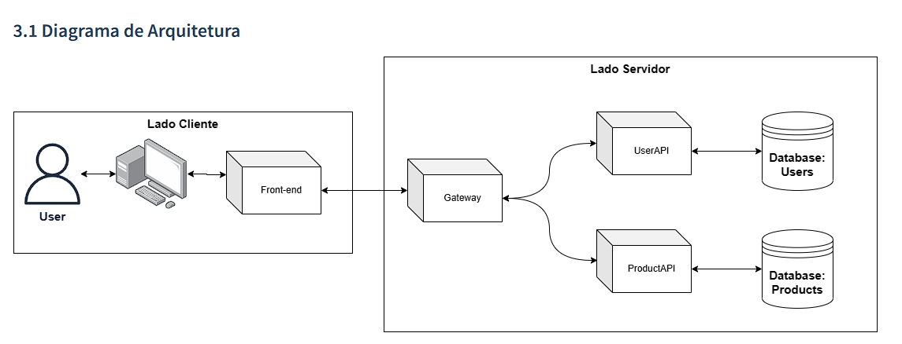

# 4.2. Módulo Reutilização de Software

## 1. Introdução

A reutilização de software é um conceito fundamental na área de desenvolvimento de software, que se baseia na ideia de aproveitar soluções já existentes para construir novas aplicações. Trata-se de um processo que busca maximizar a eficiência, produtividade e qualidade do desenvolvimento de software, evitando a reinvenção da roda a cada novo projeto.

Existem diversas formas de reutilização de software, desde a utilização de bibliotecas de código aberto até a construção de frameworks e componentes personalizados. A reutilização pode ocorrer tanto a nível de código-fonte, reutilizando trechos de código, quanto a nível de design, reutilizando padrões arquiteturais e de projeto.

## 2. Metodologia

O Módulo Reutilização de Software foi desenvolvido colaborativamente pelos membros responsáveis, através de reuniões, utilizando como base o conteúdo disponibilizado. Durante essas discussões, foram identificados pontos-chave para melhorar a qualidade e produtividade, incluindo a redução de tempo e custos, aumento da confiabilidade do produto e a aderência aos padrões estabelecidos.

## 3. Reutilização de Software

### 3.1 Factory Method

O Factory method é um padrão criacional que fornece uma abordagem flexível e escalonável para a criação de objetos. Ele permite que uma classe delegue a responsabilidade de criar objetos para suas subclasses, fornecendo assim um ponto centralizado para criação de instâncias de diferentes tipos de objetos.

Nessa abordagem, uma classe abstrata ou uma interface define um método Fábrica, que as subclasses concretas implementam para criar objetos específicos. Dessa forma o código fica mais genérico e facilita a manutenção e escalabilidade do sistema.

Algumas de suas vantagens são:

- Baixo acoplamento, visto que o código cliente não precisa conhecer a classe concreta do objeto sendo criado, apenas trabalhando com a interface implementada.
- Extensibilidade, pois permite a adição de novos tipos de objetos com facilidade, é só fazer com que implementem a interface utilizada.
- Reutilização de código, já que a lógica de criação de objetos fica centralizada no método Fábrica, e quaisquer alterações precisam ser feitas apenas nele.

Nesse projeto, o Factory Method para pagamentos gerar formas de pagamento, e com mínimos ajustes pode ser usado também para gerar produtos, já que a RiHappy fornece vários tipos de produtos que compartilham algumas características, mas possuem seus próprios atributos. Portanto pode ser criada uma interface para ser implementada por eles, e uma Fábrica para gerá-los.

### 3.2 Modelo cliente/servidor

O modelo cliente-servidor é uma arquitetura de comunicação que descreve a interação entre dois componentes principais: o cliente e o servidor. Nesse modelo, o cliente é um dispositivo ou software que solicita um serviço específico, enquanto o servidor é responsável por fornecer o serviço solicitado.

Na arquitetura cliente-servidor, o cliente envia uma solicitação ao servidor, especificando o tipo de serviço desejado. O servidor recebe essa solicitação, processa-a e envia uma resposta de volta ao cliente. O cliente, por sua vez, aguarda a resposta e a utiliza conforme necessário.

A comunicação entre o cliente e o servidor pode ocorrer em diferentes formas, como através de redes locais, a Internet ou qualquer outro meio de comunicação. O servidor geralmente possui recursos e capacidades mais avançadas do que o cliente, permitindo que ele forneça serviços especializados, como armazenamento de dados, processamento de informações, hospedagem de sites, entre outros.

Algumas vantagens incluem:

- Maior facilidade de manutenção
- Segurança dos dados, uma vez que eles ficam armazenados nos servidores, que, geralmente, possuem uma segurança superior à maioria dos clientes
- Integração de servidores para clientes com diferentes capacidades

### 3.2.1 Código do servidor TCP/IP

```python
import socket
import threading


HOST = '127.0.0.1'  
PORT = 8000  


def handle_client(client_socket, client_address):
    while True:
    
        data = client_socket.recv(1024).decode()
        if not data:
            break

        print(f"Mensagem recebida do cliente {client_address[0]}:{client_address[1]}: {data}")

    
        response = "Resposta do servidor"
        client_socket.send(response.encode())

    
    client_socket.close()


server_socket = socket.socket(socket.AF_INET, socket.SOCK_STREAM)


server_socket.bind((HOST, PORT))


server_socket.listen()

print(f"Servidor TCP/IP escutando em {HOST}:{PORT}")

while True:
    
    client_socket, client_address = server_socket.accept()
    print(f"Conexão estabelecida com {client_address[0]}:{client_address[1]}")

    
    client_thread = threading.Thread(target=handle_client, args=(client_socket, client_address))
    client_thread.start()
```

### 3.2.2 Código do cliente TCP/IP

```python
import socket


HOST = '127.0.0.1'  
PORT = 8000 


client_socket = socket.socket(socket.AF_INET, socket.SOCK_STREAM)


client_socket.connect((HOST, PORT))
print(f"Conectado ao servidor em {HOST}:{PORT}")

while True:
    
    message = input("Digite uma mensagem para o servidor: ")
    client_socket.send(message.encode())
    
    
    response = client_socket.recv(1024).decode()
    print(f"Resposta do servidor: {response}")
    
    
    if message.lower() == 'exit':
        break


client_socket.close()
```
### 3.2.3 Código do servidor com http request
```python
import socket

def create_response():
    content = b"<html><body><h1>Ol\xc3\xa1 Milene</h1></body></html>"
    response = b"HTTP/1.1 200 OK\r\n"
    response += b"Content-Type: text/html; charset=utf-8\r\n"
    response += b"Content-Length: " + str(len(content)).encode() + b"\r\n"
    response += b"\r\n"
    response += content
    return response

def start_server():
    host = 'localhost'
    port = 8002

    server_socket = socket.socket(socket.AF_INET, socket.SOCK_STREAM)
    server_socket.bind((host, port))
    server_socket.listen(1)

    print(f"Server listening on {host}:{port}")

    while True:
        client_socket, addr = server_socket.accept()
        print(f"Connection established from {addr}")

        request = client_socket.recv(1024).decode()
        print(f"Received request:\n{request}")

        response = create_response()

        client_socket.sendall(response)
        client_socket.close()

if __name__ == '__main__':
    start_server()
```

### 3.3 Estrutura de Banco de Dados

Para uma aplicação de padronização dentro de um banco de dados, pode-se colocar o exemplo do banco de dados dos produtos cadastrados no sistema.  
Tais produtos utilizam diversos campos de dados iguais, como código de barras, peso, lote, e outros dados padrões de produtos, tornando as tabelas de dados parecidas em relação a sua estrutura, e podendo ser diferenciadas dependendo do tipo de produto, como por exemplo uma piscina e uma boneca, eles possuem dados diferentes onde a piscina deve conter dados de quantidade de água suportada, e a boneca não precisa de dados como esses.

### 3.4 Requisitos para casos testes

A partir do Brainstorm levantado pelo grupo citando e levantando os requisitos é possível a reutilização desse artefato para a elaboração de casos de testes utilizando o framework HotSpot.
HotSpot sendo utilizado no contexto de casos de testes para identificar áreas críticas ou de alto risco em um sistema ou requisito específico, pois podem requerir uma maior atenção no processo de testes representando os pontos mais críticos ou complexos do sistema em termos de funcionalidade, desempenho, segurança, usabilidade ou outros critérios relevantes.

### 3.5 Reutilização de Estilos

Um exemplo marcante de reutilização dentro de qualquer projeto é sua estilização, onde é comum encontrar paletas de cores pré-definidas, e uma sequência de estilizações como em botões e textos que acabam tornando o design do sistema padronizado. E para que tudo isso aconteça, deve-se estar sempre reaproveitando códigos CSS em diversos arquivos para que isso aconteça, ou definindo no arquivo principal de estilização esses padrões de estilo.

Podemos reutilizar um mesmo componente para escrever 3 botões de Pagamento, como no exemplo abaixo vindo do nosso gof [Factory Method](https://unbarqdsw2023-1.github.io/2023.1_G4_ProjetoRiHappy/#/PadroesDeProjeto/GoFs/3.2.1.FactoryMethod)


### 3.6 Implantação do Servidor
Temos um claro exemplo de reutilização de software quando observamos nosso [Diagrama de Arquitetura](https://unbarqdsw2023-1.github.io/2023.1_G4_ProjetoRiHappy/#/Modelagem/2.1.1.2.DiagramaDePacotes) do lado do servidor:



Aqui podemos observar o reaproveitamento do modelo de implantação das API, onde a conexão do lado cliente com qualquer uma das API se dá por um fluxo parecido, onde primeiro se leva uma requisição até um gatway, e depois o liga até um dos micro-serviços.

E também pode ser visto essa reutilização dentro dos pacotes de tais API's:


As APIs simplificam o uso de funcionalidades de sistemas e serviços, promovendo a modularidade e economizando tempo. Ao abstrair os detalhes de implementação, elas facilitam a integração entre diferentes partes de um sistema, evitando a duplicação de esforços na criação de funcionalidades já existentes. Mais informações sobre como foi aplicado nessa projeto podem ser encontradas no [Módulo de padrões de projeto extras.](https://unbarqdsw2023-1.github.io/2023.1_G4_ProjetoRiHappy/#/PadroesDeProjeto/3.3.PadroesExtra)

## 4. Histórico de versões

| Versão | Descrição                                           | Autor             | Revisor           | Data       |
| ------ | --------------------------------------------------- | ----------------- | ----------------- | ---------- |
| 1.0    | Criação do documento                                | Vinícius Roriz    | Lívia Rodrigues   | 01/07/2023 |
| 1.1    | Adição da Metodologia                               | Lívia Rodrigues   | Mateus Caltabiano | 02/07/2023 |
| 1.2    | Adição da introdução para o modelo cliente/servidor | Mateus Caltabiano | Felipe Alef    | 02/07/2023 |
| 1.3    | Adição do código de servidor TCP/IP                 | Matheus Soares & João Victor Correia | Caio Vitor | 02/07/2023 |
| 1.4    | Seções 3.2.2, 3.2.3                                 | Matheus Soares & João Victor Correia | Caio Vitor | 02/07/2023 |
| 1.5    | Seções 3.1, 3.3, 3.4, 3.5, 3.6                      | Caio Vitor, Lívia Rodrigues, Vinícius Roriz, Wildemberg Sales | João Victor  | 02/07/2023 |
| 1.6    | Adição informação API seção 3.6                     | João Victor | Mateus Caltabiano | 03/07/2023 |

## 5. Referências bibliográficas

> https://www.devmedia.com.br/reutilizacao-de-software-revista-engenharia-de-software-magazine-39/21956
> SERRANO, M; Arquitetura e Desenho de Software, Aula - Reutilização de Software. UnB-FGA. Acesso em: 02/07/2023.
> UFSC. Redes de Computadores. Disponível em: http://www.inf.ufsc.br/~j.barreto/cca/internet/redesde.htm. Acesso em: 02 jul. 2023.