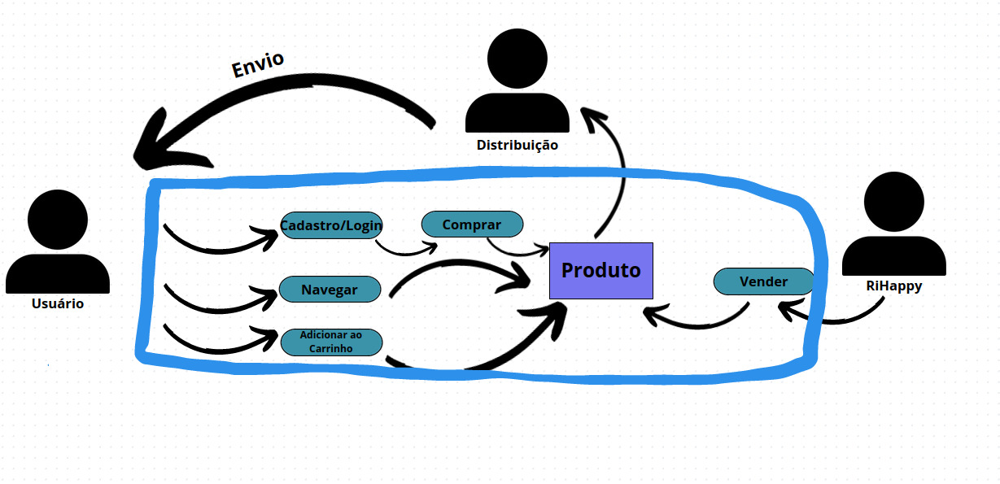
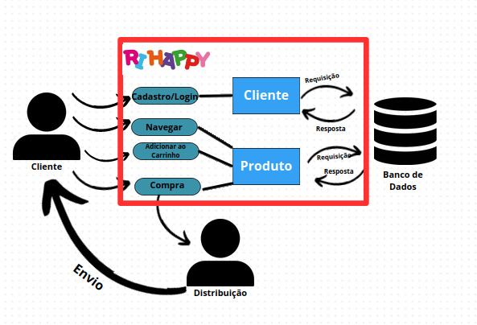
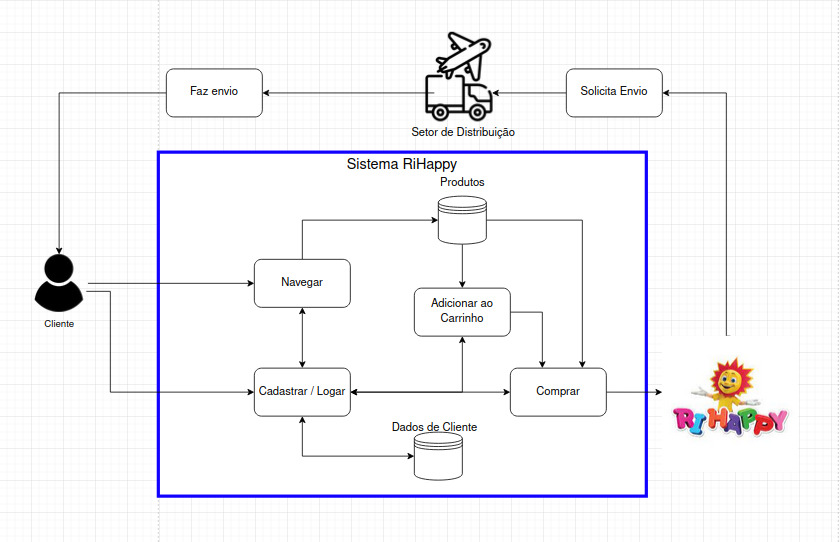

# Léxicos

## 1. Introdução

 Uma das atividades mais importantes do desenvolvimento de um bom software está em uma boa elicitação de requisitos, afinal, é nessa etapa que é listado o que o cliente quer. Uma das maneiras mais livres e espontâneas de se elicitar esses requisitos é usando a técnica do Rich Picture.

## 2. Metodologia

 Rich Picture, do inglês “figura rica”, consiste em fazer desenhos que representem o funcionamento do serviço que está sendo proposto. É uma forma de modelagem de ideias, pouco formal, que pode ser feito a mão em uma reunião, por exemplo. Uma das maiores vantagens do Rich Picture é o feedback instantâneo do cliente sobre o funcionamento, arquitetura e desenho do que está sendo desenhado. Por mais que possa ser utilizado para elicitação de requisitos, essa técnica não se limita a isso, podendo ser usada também para arquitetura e desenho de software.

## 3. Rich Picture

### Versão 1.0

### Versão 1.1

### Versão 2.0

## 4. Histórico de versões

| Versão | Descrição            | Autor           | Revisor           | Data           |
| :------: | -------------------- | --------------- | ----------------- | -------------- |
| 1.0    | Criação do artefato de Rich Picture |Caio Vitor Carneiro| Wildemberg Sales| 17/04/2023 |

## 5. Referências bibliográficas

> MILENE. Arquitetura e Desenho de software - Aula Projeto-DSW [apostila]. Universidade de Brasília. Disponível em: https://www.google.com/url?sa=t&rct=j&q=&esrc=s&source=web&cd=&ved=2ahUKEwiri9KLpbH-AhXQqJUCHSoWAy4QFnoECB8QAw&url=https%3A%2F%2Fmspguide.org%2F2022%2F03%2F18%2Frich-picture%2F&usg=AOvVaw2UWChGEh58mnyy7YPcol5Y. Acesso em: 17 abr. 2023.

