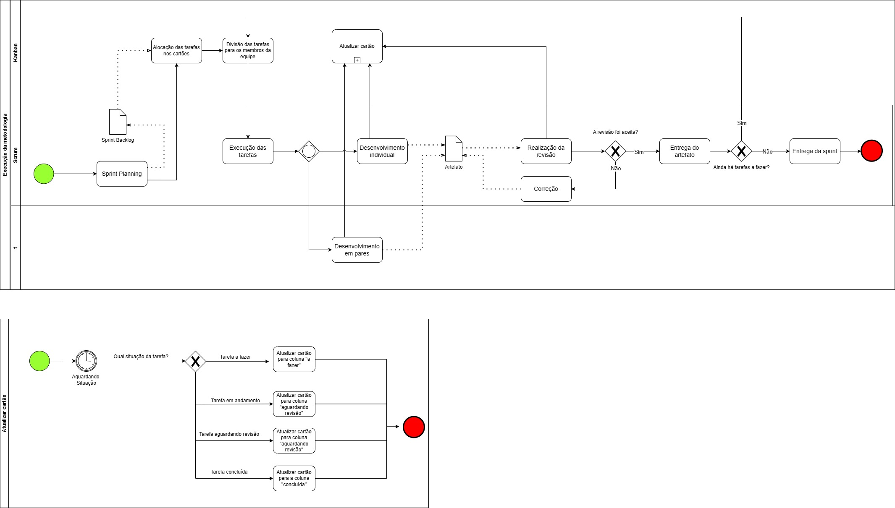

# BPMN

## 1. Introdução

O BPMN é uma ferramenta importante para a melhoria de processos de negócios, permitindo que as empresas possam descrever, analisar, projetar, implementar e monitorar seus processos de forma mais eficiente. Além disso, a notação é usada para documentar, comunicar e compartilhar informações sobre processos entre diferentes áreas e equipes de uma organização. O BPMN é uma notação amplamente utilizada e recomendada por organizações e especialistas em processos de negócios em todo o mundo.

## 2. Metodologia

A equipe utilizou o discord para realizar reuniões virtuais e discutir ideias durante a criação de um fluxograma de processos de negócios. Além disso, o diagrams.net foi a ferramenta escolhida para criar o BPMN. A plataforma permitiu que o grupo trabalhasse colaborativamente para criar um artefato visualmente atraente e padronizado, facilitando a documentação e a comunicação dos processos de negócios entre os membros da equipe.

## 3. Artefato

## 4. Histórico de versões

| Versão | Descrição            | Autor           | Revisor           | Data           |
| ------ | -------------------- | --------------- | ----------------- | -------------- |
| 1.0    | Criação do artefato | Felipe Alef | Mateus Caltabiano | 24/04/2023 |

