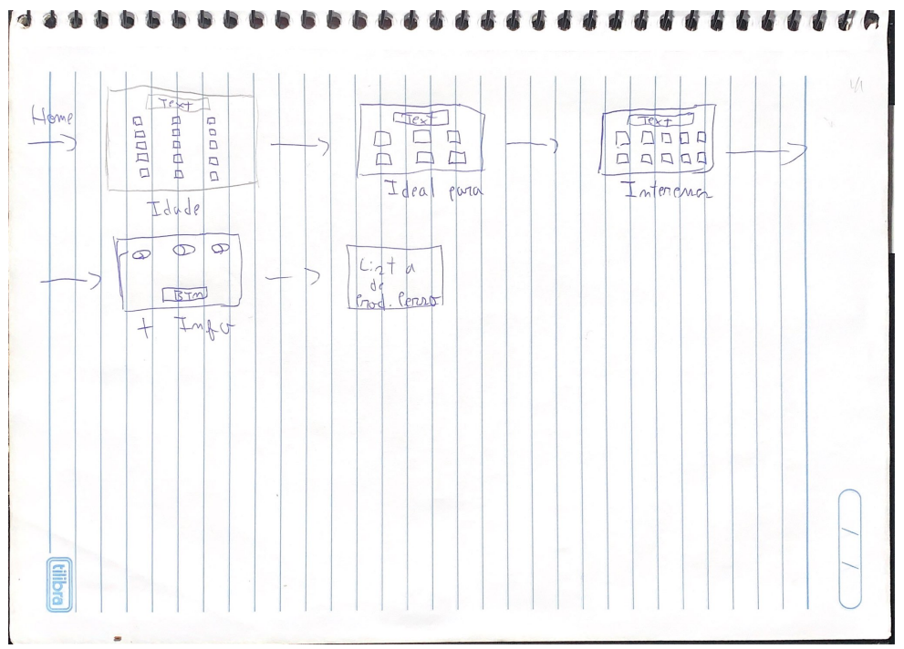

# Prototipagem

## 1. Introdução

A prototipação utiliza os requisitos  até então levantados para a criação de um modelo simplificado do sistema. O principal objetivo na criação do protótipo é reduzir os riscos e permitir que todas as validações sejam feitas antes da implementação.

Protótipos são comumente classificados com relação à sua fidelidade. A fidelidade do protótipo refere-se ao nível de detalhes e funcionalidade incorporada a ele. Nesse sentido, o protótipo de alta fidelidade é utilizado quando existe o foco de validar a arquitetura da informação e a interatividade com os elementos da interface.

## 2. Metodologia

Para a criação desse artefato utilizamos os requisitos levantados até o momento a partir do brainstorm e storyboard que ainda não foram implementados no website RiHappy. Para desenvolver o Protótipo utilizamos o Figma.

## 3. Protótipos
Foram desenvolvidos dois fluxos: 

- Newletter: Referente a funcionalidade [BS25 ](https://unbarqdsw2023-1.github.io/2023.1_G4_ProjetoRiHappy/#/Base/1.1.1.5.Brainstorm)levantada no Brainstorm
- Presente Perfeito: Referente a funcionalidade [BS26 ](https://unbarqdsw2023-1.github.io/2023.1_G4_ProjetoRiHappy/#/Base/1.1.1.5.Brainstorm) levantada no Brainstorm

### Baixa Fidelidade

### Alta Fidelidade
<iframe style="border: 1px solid rgba(0, 0, 0, 0.1);" width="800" height="450" src="https://www.figma.com/embed?embed_host=share&url=https%3A%2F%2Fwww.figma.com%2Ffile%2FyBVMC2i2dFsPpVEyDb1WMT%2FUntitled%3Fnode-id%3D1%253A2%26t%3DvplC55Qlp2gLGG7m-1" allowfullscreen></iframe>

## 4. Histórico de versões

| Versão | Descrição            | Autor           | Revisor           | Data           |
| ------ | -------------------- | --------------- | ----------------- | -------------- |
| 1.0    | Criação do documento | João Victor Correia | Matheus Soares | 24/04/2023 |
