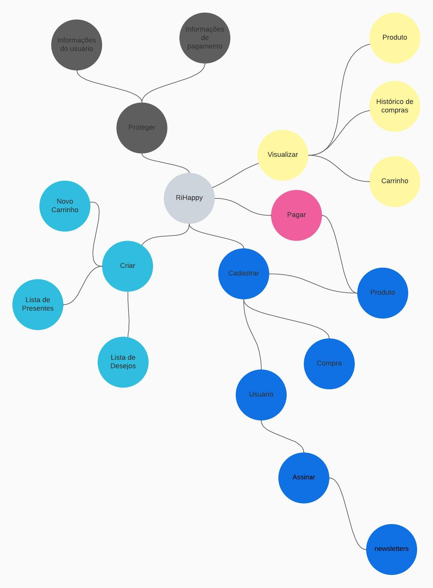

# Mapa Mental

## 1. Introdução

Um mapa mental é uma representação gráfica de ideias e informações, onde um conceito central é colocado no centro do mapa e ramos conectados a ele representam ideias relacionadas. Esses ramos podem se ramificar ainda mais em subconceitos, criando uma rede de informações que podem ser facilmente visualizadas e compreendidas.

## 2. Metodologia

Foi feita uma reunião com 4 membros da equipe onde o objetivo era analisar os fluxos de cadastro, visualização, compra de produtos no site da RiHappy. A reunião foi feita por meio do Discord e o mapa foi confeccionado no lucidchart.

Reunião: 18/04/2023 - 21:00hrs
- Participantes:
> - Matheus Soares
> - João Victor Correia
> - Pedro Henrique Nogueira
> - Felipe Álef

## 3. Mapa Mental

Fonte: Grupo 4

## 4. Histórico de versões

| Versão | Descrição            | Autor           | Revisor           | Data           |
| ------ | -------------------- | --------------- | ----------------- | -------------- |
| 1.0    | Criação do artefato Mapa mental | Matheus Soares | Felipe Álef | 18/04/2023 |

## 5. Referências bibliográficas

> Novak, J. D., & Gowin, D. B. (1999). Aprender a aprender. Lisboa: Plátano.
