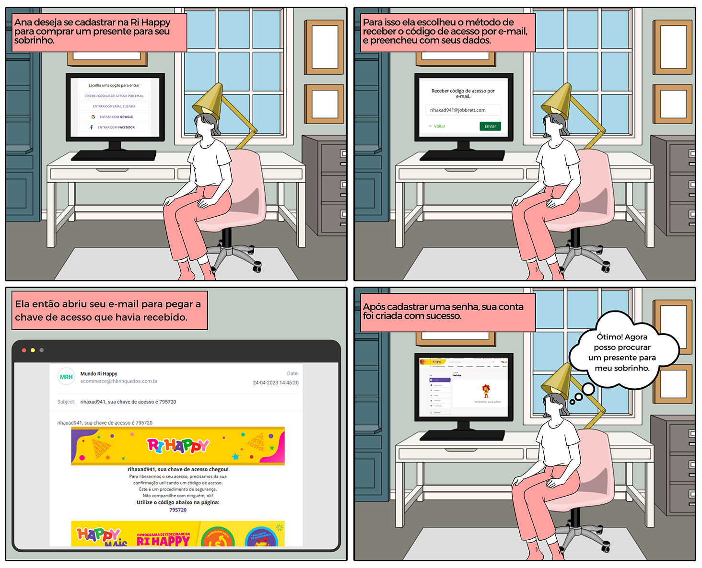
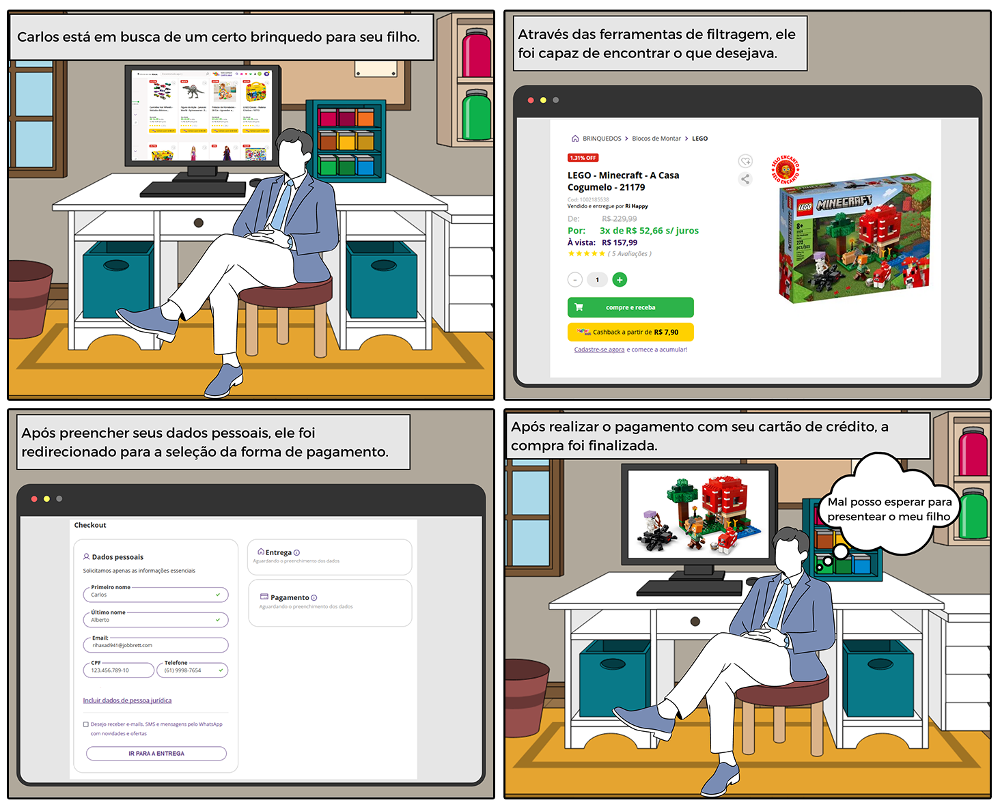
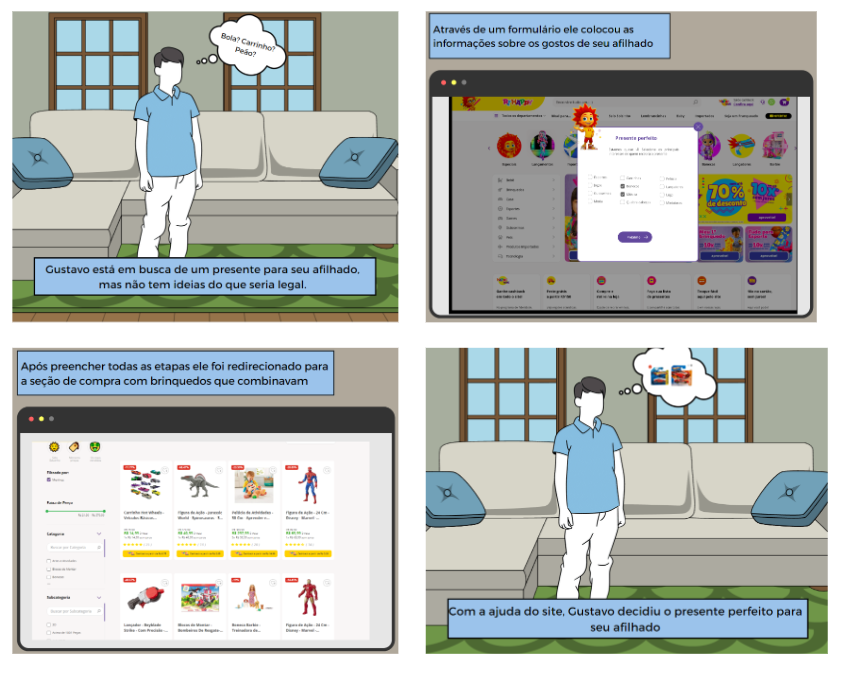

# Storyboard

## 1. Introdução

 Storyboards são esboços de interface de usuário que descrevem como um aplicativo ou site deve ser apresentado ao usuário. Geralmente são criados no estágio inicial de design para ajudar a visualizar a navegação, layout, fluxos de trabalho, etc. Eles ajudam a equipe de desenvolvimento a entender como o aplicativo ou site deve funcionar e permitem que os designers e desenvolvedores comuniquem suas ideias de maneira eficaz.

## 2. Storyboard

 Foram criados 2 storyboards, descrevendo os fluxos de cadastro de usuário e visualização/compra de um produto no site da Ri Happy.

### 2.1 Storyboard 1

 Um cliente realiza seu cadastro no site para ser capaz de comprar um produto.

 

 

### 2.2 Storyboard 2

 Um cliente procura um produto específico, e realiza a compra.

### 2.2 Storyboard 3

 Um cliente procura um presente de acordo com suas preferências.

## 5. Histórico de Versão

| Versão |       Alteração        |  Responsável    |    Revisor    | Data  |
| :----: | :--------------------: | :-------------: | :-----------: | :---: |
|  1.0   |   Criando documento    | Vinícius Roriz  |               | 24/04/2023 |
|  1.0   |   Adição StoryBoard3     | João Victor Correia  |        Mateus Caltabiano       | 24/04/2023 |