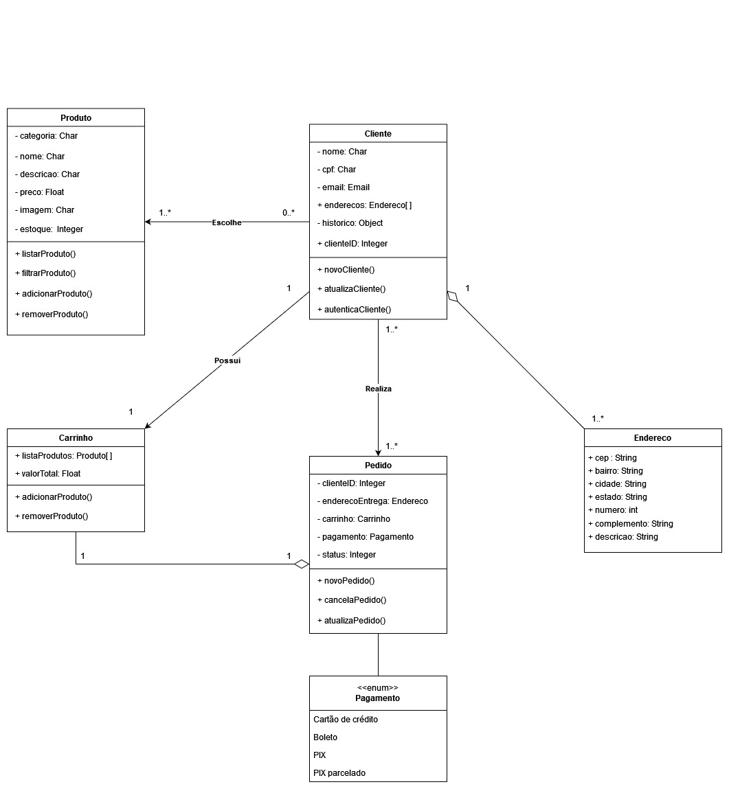

# Diagrama de classes

## 1. Introdução

Uma das principais ferramentas utilizadas na modelagem de sistemas orientados a objetos é o diagrama de classes. Através dele é possível representar de maneira visual as classes do sistema, junto com seus respectivos atributos e métodos, além das relações entre as diferentes classes, permitindo assim a melhor compreensão e manutenção do código fonte.

## 2. Metodologia

O artefato foi realizado na plataforma [draw.io](https://www.drawio.com/), sendo desenvolvido de maneira simultânea pelos membros mediante discussão.

## 3. Diagrama de Classes

 

## 4. Histórico de versões

| Versão | Descrição            | Autor           | Revisor           | Data           |
| ------ | -------------------- | --------------- | ----------------- | -------------- |
| 1.0    | Criação do documento | Vinícius Roriz | João Victor Correia | 09/05/2023 |
| 1.1    | Adição do artefato | Iago Cabral, Pedro Henrique Nogueira, Vinícius Roriz | João Victor Correia | 11/05/2023 |

## 5. Referências bibliográficas

> https://www.lucidchart.com/pages/pt/o-que-e-diagrama-de-classe-uml
> http://www.dsc.ufcg.edu.br/~jacques/cursos/map/html/uml/diagramas/classes/classes3.htm

