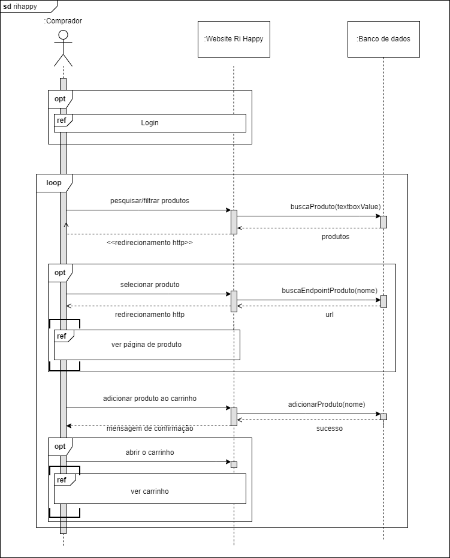

# Diagrama de Sequência

## 1. Introdução

Um diagrama de sequência é uma representação gráfica que descreve a interação entre objetos em um sistema ou processo. Ele ilustra a ordem das ações e as trocas de mensagens entre os objetos ao longo do tempo.

Esse tipo de diagrama é amplamente utilizado na modelagem de sistemas orientados a objetos e na análise de processos de negócios. Ele permite visualizar como os objetos colaboram entre si para realizar uma determinada tarefa ou atingir um objetivo específico.

No diagrama de sequência, os objetos são representados por retângulos verticais, e as interações entre eles são mostradas por setas que indicam o fluxo das mensagens. As mensagens podem ser síncronas, quando o objeto emissor aguarda a resposta do objeto receptor, ou assíncronas, quando o objeto emissor não aguarda a resposta imediata.

## 2. Metodologia

A equipe responsável por este diagrama se reuniu via discord para visualizar o funcionamento do site e desenvolver o diagrama utilizando o site draw.io.

Inicialmente foi pensado o diagrama principal, que é seria uma visão geral do funcionamento do site. Construindo ele, vimos a necessidade de expandir algumas partes em outros diagramas, para evitar um fluxo longo e que poderia ficar confuso. Adicionamos então as 3 primeiras referências: o diagrama de login, ver página de produto e ver carrinho. No diagrama de login, achamos necessário criar uma nova referência, que gerou o diagrama de perfil. No diagrama de carrinho, também pensamos na possibilidade de criar nova referência, que seria o diagrama de checkout, mas acabamos optando por deixar o checkout incluso junto com o carrinho por sermos obrigados a passar pelo carrinho para finalizar a compra.

Após a apresentação deste artefato, foi feita a segunda versão dos diagramas geral, do produto e do carrinho, adicionando um ou mais objetos que melhoram o detalhamento e entendimento do funcionamento sequencial da aplicação.

## 3. Diagrama de Sequência

### 3.1 Diagrama geral - versão 1

Imagem 1: Diagrama geral v1

Fonte: Grupo 4

### 3.2 Diagrama geral - versão 2

Após as considerações dadas na apresentação, foi adicionado o objeto banco de dados, que seria de onde o site busca as requisições solicitadas pelo cliente, deixando o objeto Website Rihappy demonstrando apenas o que está diretamente em contato com o comprador.

Imagem 2: Diagrama geral v2

Fonte: Grupo 4

### 3.3 Diagrama do login

Imagem 3: diagrama do login

Fonte: Grupo 4

### 3.4 Diagrama do produto - versão 1

Imagem 4: diagrama do produto v1

Fonte: Grupo 4

### 3.5 Diagrama do produto - versão 2

Adicionamos os objetos banco de dados e correios para um melhor detalhamento do backend da aplicação e, especificamente neste diagrama, da comunicação com os correios para buscar os preços dos diferentes fretes

Imagem 5: Diagrama do produto v2

Fonte: Grupo 4

### 3.6 Diagrama do carrinho - versão 1

Imagem 6: Diagrama do carrinho v1

Fonte: Grupo 4

### 3.7 Diagrama do carrinho - versão 2

Imagem 7: Diagrama do carrinho v2

Fonte: Grupo 4

### 3.8 Diagrama do perfil

Imagem 8: Diagrama do perfil

Fonte: Grupo 4

## 4. Histórico de versões

| Versão | Descrição                                                                       | Autor                                          | Revisor                 | Data       |
| ------ | ------------------------------------------------------------------------------- | ---------------------------------------------- | ----------------------- | ---------- |
| 1.0    | Abertura do documento                                                           | Matheus Soares                                 | Iago de Paula Cabral    | 12/05/2023 |
| 1.1    | Elaboração do diagrama geral                                                    | Mateus Caltabiano, Felipe Alef, Matheus Soares | Iago de Paula Cabral    | 12/05/2023 |
| 1.2    | Elaboração do diagrama do login                                                 | Mateus Caltabiano, Felipe Alef, Matheus Soares | Iago de Paula Cabral    | 13/05/2023 |
| 1.3    | Elaboração do diagrama do produto                                               | Mateus Caltabiano, Felipe Alef, Matheus Soares | Pedro Henrique Nogueira | 13/05/2023 |
| 1.4    | Elaboração do diagrama do carrinho                                              | Mateus Caltabiano, Felipe Alef, Matheus Soares | Pedro Henrique Nogueira | 13/05/2023 |
| 1.5    | Elaboração do diagrama do perfil                                                | Mateus Caltabiano, Felipe Alef, Matheus Soares | Caio Vitor              | 14/05/2023 |
| 1.6    | Detalhamento da metodologia                                                     | Mateus Caltabiano                              | Vinicius Roriz          | 14/05/2023 |
| 1.7    | Adição da segunda versão de alguns diagramas e novo detalhamento da metodologia | Mateus Caltabiano                              |                         | 15/05/2023 |

## 5. Referências bibliográficas

> UNIVERSIDADE DE BRASÍLIA. Arquitetura e Desenho de Software - Aula Modelagem UML Dinâmica - Profa. Milene. Disponível em: https://aprender3.unb.br/pluginfile.php/2482561/mod_label/intro/Arquitetura%20e%20Desenho%20de%20Software%20-%20Aula%20Modelagem%20UML%20Dinâmica%20-%20Profa.%20Milene.pdf. Acesso em: 12 maio 2023.
