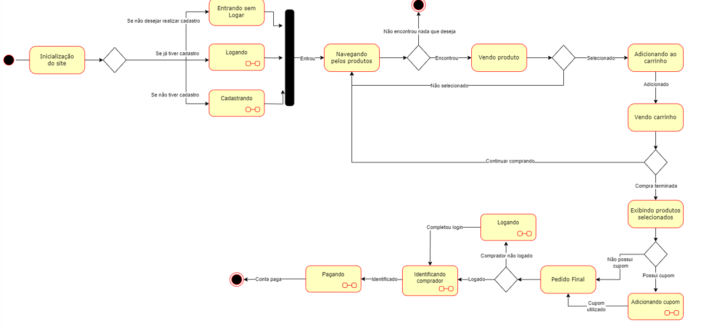

# Diagrama de Estados

## 1. Introdução

O Diagrama de Estados é um tipo de diagrama dinâmico que modela o comportamento discreto em sistemas de transição entre estados finitos. Ele é conhecido como Diagrama de Máquina de Estados e é utilizado na Linguagem de Modelagem Unificada (UML) para mostrar as transições entre objetos. 

O diagrama é composto por elementos como o Estado Inicial, que representa o ponto de início da utilização do objeto, o Estado Final, que é o ponto de saída do objeto, o Estado, que representa um dos possíveis estados que um objeto pode assumir, e o Evento ou Transição, que representa uma ação externa que afeta o objeto. 

As Ações também são importantes e são processos associados à transição de estados. Existem três tipos de Ações: Ação de Entrada, que é executada para chegar a um determinado estado, Ação de Saída, que é executada quando se sai de um estado, e Ação de Atividade, que é executada dentro do estado. 

Os diagramas de estados são amplamente utilizados para representar as transições de estados dos fluxos principais da aplicação e ajudam a visualizar o comportamento do sistema em diferentes situações. Ao utilizar esses diagramas, é possível identificar possíveis erros ou problemas no sistema e, assim, melhorar sua eficiência e eficácia.

## 2. Metodologia

A produção do artefato foi realizada em conjunto pelos membros responsáveis, através de discussões e utilizando como base os artefatos criados anteriormente e paralelamente. Primeiramente foi desenhado um diagrama de estado geral, assumindo todos os possíveis estados de um fluxo de compra idealizados na [etapa anterior](https://unbarqdsw2023-1.github.io/2023.1_G4_ProjetoRiHappy/#/Base/1.1.1.designSprint), ao finalizar foi idenficado a necessidade de criar subfluxos explicando melhor algumas etapas, pois essas eram abrangentes demais. Por isso esse digrama foi dividido em duas partes: Geral e Subfluxos. 

## 3. Diagrama de Estado Geral 

## 4. Histórico de versões

| Versão | Descrição            | Autor           | Revisor           | Data           |
| ------ | -------------------- | --------------- | ----------------- | -------------- |
| 1.0    | Criação do documento | Lívia Rodrigues, João Correia |  | 14/05/2023 |

## 5. Referências bibliográficas

> LUCIDCHART. O que é um diagrama de máquina de estados?. Disponível em: https://www.lucidchart.com/pages/pt/o-que-e-diagrama-de-maquina-de-estados-uml . Acesso em: 08 de maio. 2023.
