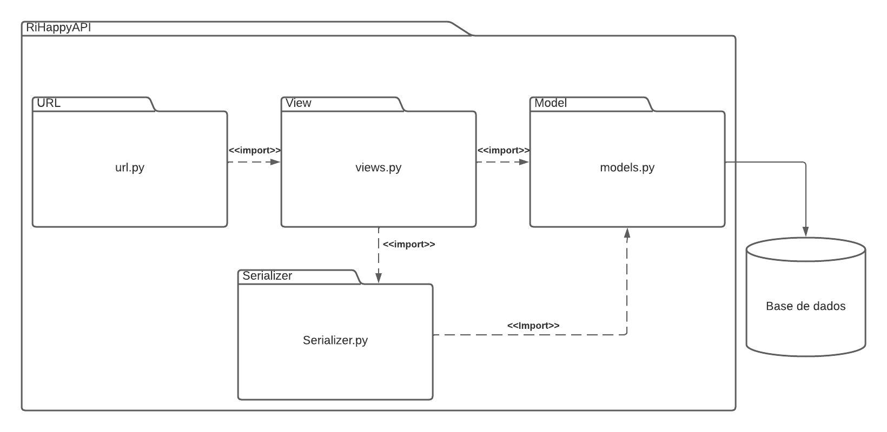
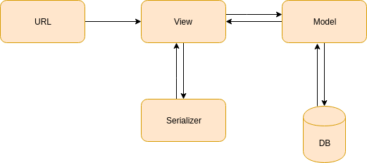

# 1. Introdução

O Padrão de Transferência de Estado Representacional (REST - Representational State Transfer) é um estilo de arquitetura amplamente utilizado para projetar e desenvolver serviços web escaláveis e interoperáveis. Ele se baseia em princípios simples e utiliza os protocolos e recursos da web de forma eficiente.

O REST enfatiza a simplicidade, escalabilidade e independência de plataforma, o que o torna uma escolha popular para construção de APIs (Interfaces de Programação de Aplicativos) e serviços web. Ele é amplamente adotado por grandes empresas e é suportado por muitos frameworks e bibliotecas.

## Princípios do REST

O REST é baseado em alguns princípios fundamentais que orientam a forma como os serviços e recursos devem ser projetados. Aqui estão alguns dos principais princípios do REST:

1. **Arquitetura Cliente-Servidor**: O REST segue o modelo cliente-servidor, onde o cliente faz solicitações para o servidor, que responde com os dados solicitados. Isso permite uma separação clara entre as preocupações do cliente e do servidor.

2. **Estado da Aplicação**: O servidor não mantém informações sobre o estado do cliente. Em vez disso, cada solicitação do cliente deve conter todas as informações necessárias para o servidor processá-la. O estado da aplicação é transferido entre as solicitações.

3. **Recursos e URIs**: Os recursos são as entidades que um serviço REST expõe. Cada recurso é identificado por uma URI (Uniform Resource Identifier). As URIs devem ser consistentes, significativas e descrever de forma clara os recursos a que se referem.

4. **Operações HTTP**: O REST utiliza as operações HTTP (GET, POST, PUT, DELETE, etc.) para realizar ações em recursos. Cada operação é mapeada para uma ação específica no recurso correspondente.

5. **Representações**: Os recursos são representados em um formato específico, como JSON ou XML. O cliente pode solicitar uma representação específica do recurso, e o servidor responderá com os dados nesse formato.

# 2. Metodologia

Ao projetar uma API REST, é importante seguir uma metodologia consistente para garantir a coerência e a facilidade de uso. Aqui estão algumas diretrizes a serem consideradas ao adotar o REST:

1. **Identifique e modele recursos**: Identifique os principais recursos que seu serviço oferecerá e modele-os de forma clara e consistente. Defina URIs intuitivas e significativas para cada recurso.

2. **Utilize os verbos HTTP corretos**: Mapeie as operações do seu serviço REST para os verbos HTTP apropriados. Use GET para recuperar recursos, POST para criar novos recursos, PUT para atualizar recursos existentes e DELETE para excluir recursos.

3. **Padronize as respostas**: Defina um formato padrão para as respostas do seu serviço, como JSON ou XML. Forneça informações adequadas de status e utilize códigos de status HTTP apropriados para indicar o resultado da solicitação.

4. **Considere a segurança**: Implemente mecanismos de segurança adequados, como autenticação e autorização, para proteger sua API REST contra acessos não autorizados.

5. **Documente sua API**: Crie uma documentação clara e abrangente para sua API REST, descrevendo todos os recursos disponíveis, suas URIs, parâmetros, formatos de resposta e exemplos de solicitação.

# 3. Arquitetura Django REST

A arquitetura Django REST é um padrão de design que é amplamente utilizado para criar APIs RESTful (Representational State Transfer) usando o framework Django. O Django é um framework web de alto nível escrito em Python, e o Django REST framework é uma extensão desse framework que facilita a criação de APIs web.

A estrutura básica de uma aplicação Django REST consiste em:

1. **Models**: As models no Django são a camada de abstração do banco de dados. Eles definem a estrutura dos dados que serão armazenados e manipulados na aplicação.

   

2. **View**: As views são as classes ou funções que lidam com as solicitações HTTP recebidas pela API. Elas processam as solicitações e retornam as respostas adequadas. No Django REST, as views são geralmente baseadas em classes e podem ser configuradas para lidar com diferentes métodos HTTP (GET, POST, PUT, DELETE, etc.).

   

   

3. **Serializer**: Os serializers são responsáveis por converter objetos Python em formatos que possam ser facilmente transmitidos pela rede, como JSON. Eles fornecem uma maneira de representar os dados do modelo para a API.

4. **URL**: As URLs mapeiam as solicitações HTTP para as views apropriadas. No Django REST, você pode definir as URLs usando o roteador integrado ou mapeá-las manualmente usando o arquivo de configuração.

5. **Test**: O framework REST inclui algumas classes auxiliares que herdam a estrutura de teste existente do Django e melhoram o suporte para fazer requisições para a API.

# 4. Recursos

Para criarmos o padrão REST, utilizamos um framework em python, o Django.
Por convenção o servidor roda na porta 8000

### Departamentos

#### Listar Departamentos

- **Endpoint**
  - `GET /departments`
- **Descrição**
  - Retorna uma lista de todos os departamentos.

#### Detalhes do Departamento

- **Endpoint**
  - `GET /departments/{id}`
- **Descrição**
  - Retorna informações detalhadas sobre um departamento específico com o ID fornecido.

#### Criar Departamento

- **Endpoint**
  - `POST /departments`
- **Descrição**
  - Cria um novo departamento com as informações fornecidas no corpo da solicitação.

#### Atualizar Departamento

- **Endpoint**
  - `PUT /departments/{id}`
- **Descrição**
  - Atualiza as informações de um departamento específico com o ID fornecido.

#### Deletar Departamento

- **Endpoint**
  - `DELETE /departments/{id}`
- **Descrição**
  - Deleta um departamento específico com o ID fornecido.

### Produtos

#### Listar Produtos

- **Endpoint**
  - `GET /products`
- **Descrição**
  - Retorna uma lista de todos os produtos.

#### Detalhes do Produto

- **Endpoint**
  - `GET /products/{id}`
- **Descrição**
  - Retorna informações detalhadas sobre um produto específico com o ID fornecido.

#### Criar Produto

- **Endpoint**
  - `POST /products`
- **Descrição**
  - Cria um novo produto com as informações fornecidas no corpo da solicitação.

#### Atualizar Produto

- **Endpoint**
  - `PUT /products/{id}`
- **Descrição**
  - Atualiza as informações de um produto específico com o ID fornecido.

#### Deletar Produto

- **Endpoint**
  - `DELETE /products/{id}`
- **Descrição**
  - Deleta um produto específico com o ID fornecido.

## 4. Histórico de versões

| Versão | Descrição                   | Autor               | Revisor                                                        | Data       |
| ------ | --------------------------- | ------------------- | -------------------------------------------------------------- | ---------- |
| 1.0    | Criação do documento        | Iago Cabral         | Caio Vitor, Lívia Rodrigues, Vinícius Roriz e Wildemberg Sales | 06/06/2023 |
| 1.1    | Adição de Diagramas         | Felipe Alef         | João Correia                                                   | 11/06/2023 |
| 1.2    | Adição de trechos do código | João Victor Correia | Mateus Caltabiano, Matheus Soares e Pedro Henrique             | 11/06/2023 |

## Referências bibliográficas

> Cesare Pautasso. "RESTful Web Services: Principles, Patterns and Emerging Technologies, In: Web Services Foundations, Springer, 2013, pp. 31-51" Disponível em: http://www.pautasso.info/biblio/2013/rest/. Acesso em: 11/06/2023.

> Documentação Django Rest Disponível em: https://www.django-rest-framework.org/. Acesso em: 11/06/2023.
