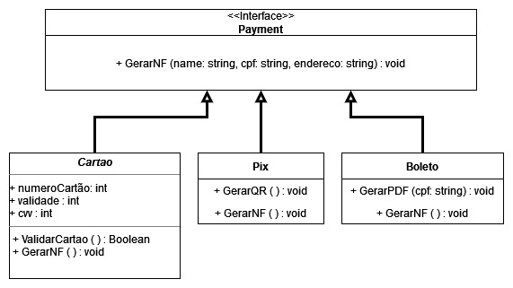

# Baixo Acoplamento

## 1. Introdução

GRASPs (General responsibility assignment software patterns) são um conjunto de padrões de design de software que auxiliam os desenvolvedores na atribuição de responsabilidades aos objetos em um sistema orientado a objetos.

Um desses padrões é o Baixo Acoplamento, que promove a redução de dependências entre objetos. Dessa maneira, uma mudança realizada em uma classe acarreta em um menor impacto em outras classes, e ainda aumenta o potencial de reutilização de módulos.

Para reduzirmos o acoplamento entre duas classes, precisamos delegar a cada uma suas devidas responsabilidades. Vejamos um exemplo de classes com alto acoplamento:

```java
public class Carro {
    @Override
    public void move() {
        System.out.println("Carro está se movendo.");
    }
}

class Viajante {
    Carro c = new Carro();
    public void comecarJornada() {
        c.move();
    }
}
```
Nesse exemplo, a classe `Viajante` está fortemente acoplada à classe `Carro`. O viajante cria um objeto do tipo Carro diretamente, isso gera mais trabalho se quisermos expandir o número de veículos no futuro, dificultando a modificação ou reutilização de código.

Agora, vamos ver algumas mudanças que reduziriam o acoplamento:

```java
interface Veiculo {
    public void move();
}

class Carro implements Veiculo {
    @Override
    public void move() {
        System.out.println("Carro está se movendo.");
    }
}

class Moto implements Veiculo {
    @Override
    public void move() {
        System.out.println("Moto está se movendo.");
    }
}

class Viajante {
    private Veiculo v;

    public Veiculo getVeiculo() {
        return v;
    }

    public void setVeiculo(Veiculo v) {
        this.v = v;
    }

    public void comecarJornada() {
        v.move();
    }
}
```
Adicionar uma interface `Veiculo` para ser implementada pelos nossos métodos de transporte permite que a classe `Viajante` utilize qualquer classe que implemente a interface. Isso resulta em uma separação clara de responsabilidades entre as classes e torna o código mais modular e flexível para futuras mudanças.

## 2. Metodologia

Foi definido em sala que seriam divididos 2 grupos para realizar 1 GoF e 1 GRASP cada, e um terceiro grupo responsável pelo padrão extra.

Na terça-feira (06/06) foi realizada uma reunião com os seguintes membros:
- Caio Vitor
- Lívia Rodrigues
- Vinícius Roriz
- Willdemberg Sales

Durante a qual foi criada a modelagem do padrão GoF. Ficou definido então que os membros Caio Vitor e Willdemberg Sales ficariam responsáveis por implementar o padrão em código, enquanto os restantes fariam o GRASP.

## 3. Baixo Acoplamento
### 3.1 Aplicação

No projeto, o baixo acoplamento foi utilizado na parte de pagamento, onde todos os diferentes métodos de pagamento implementam a interface `Payment`, permitindo que nossa classe que gera pagamentos retorne um objeto genérico do tipo da interface, garantindo a flexibilidade do código caso mais métodos de pagamento sejam adicionados.

### 3.2 Modelagem


### 3.3 Código

```typescript
interface Payment {
    GerarNF():String;
}

class Cartao implements Payment {
    constructor(private name:string, private cpf:string, private endereco:string){}

    GerarNF(): String {
        return `Nota Fiscal do Cartao: ${this.name} ${this.cpf} ${this.endereco}`
    }
}

class Pix implements Payment {
    constructor(private name:string, private cpf:string, private endereco:string){}

    GerarNF(): String {
        return `Nota Fiscal do Pix: ${this.name} ${this.cpf} ${this.endereco}`
    }
}

class Boleto implements Payment {
    constructor(private name:string, private cpf:string, private endereco:string){}

    GerarNF(): String {
        return `Nota Fiscal do Boleto: ${this.name} ${this.cpf} ${this.endereco}`
    }
}
```

## 4. Histórico de versões

| Versão | Descrição                | Autor             | Revisor           | Data          |
| ------ | ------------------------ | ----------------- | ----------------- | ------------- |
| 1.0    | Criação do artefato      | Vinícius Roriz    | Lívia Rodrigues   | 09/06/2023    |
| 1.1    | Adição das seções 1 e 2  | Vinícius Roriz    | Lívia Rodrigues   | 09/06/2023    |
| 1.2    | Adição das seções 3.1 e 3.2       | Lívia Rodrigues, Vinícius Roriz    | Willdemberg Sales   | 10/06/2023    |
| 1.3    | Adição da seção 3.3  | Vinícius Roriz    | Lívia Rodrigues   | 11/06/2023    |

## 5. Referências bibliográficas

> https://www.javaguides.net/2018/08/coupling-in-java-with-example.html
