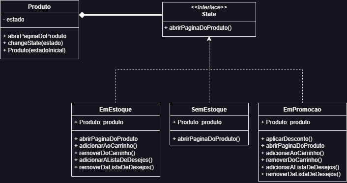

# Alta Coesão

## 1. Introdução

A alta coesão é um princípio fundamental no design de software, que visa garantir uma estrutura bem organizada e de fácil manutenção. Esse princípio enfatiza a atribuição de responsabilidades de forma clara e coesa a cada classe ou componente do sistema.

Quando uma classe possui alta coesão, significa que suas responsabilidades estão agrupadas de maneira lógica e relacionada entre si. Isso implica que a classe é projetada com uma única responsabilidade bem definida, evitando a mistura de funcionalidades diferentes. Dessa forma, ela pode se concentrar em realizar um conjunto coerente de tarefas, sem dispersar seu propósito principal.

Ao promover a alta coesão, torna-se mais fácil compreender e modificar o código, pois as classes têm um escopo limitado e se concentram em uma funcionalidade específica. Além disso, essa abordagem facilita a reutilização do código, uma vez que as classes são independentes e podem ser utilizadas em diferentes contextos, sem causar impactos indesejados.

Portanto, ao adotar o princípio da alta coesão, estamos promovendo uma estrutura de software mais robusta, flexível e sustentável ao longo do tempo.

## 2. Metodologia

O GRASP de Alta Coesão foi pensado naturalmente enquanto fazíamos o GoF "State". Para os diferentes estados que um objeto pode assumir no GoF, era de se esperar que cada estado tivesse um funcionamento diferente, e, portanto, fariam um conjunto coerente de tarefas.

Para melhor demonstrar esse conceito, alguns trechos de código serão adicionados abaixo. Como o nosso GoF tem apenas uma pequena representação em console da mudança de estado, não foram implementados os métodos abaixo nas classes.

Nos trechos abaixo, também utilizamos da modelagem do GoF, mas as classes foram melhor detalhadas, com alguns métodos que fazem sentido no contexto real do site. A implementação abaixo não apresenta o código dos métodos, e foi feita apenas para uma melhor visualização do princípio de alta coesão, mostrando a não repetição de métodos nas classes.

## 3. GRASP - Alta Coesão

### Modelagem



Essa modelagem é a segunda versão da modelagem do GoF State, e foi a que utilizamos para a implementação do GRASP, como pode ser visto abaixo.

### Classe EstadoProduto

```JAVA
package estados;

public abstract class EstadoProduto {
    public abstract void exibirEstado();
    public abstract void abrirPaginaDoProduto();
}
```

### Estado "Em estoque"

```JAVA
package estados;

public class EmEstoque extends EstadoProduto {
    @Override
    public void exibirEstado() {
        System.out.println("O produto está em estoque.");
    }

    @Override
    public void abrirPaginaDoProduto() {
        //Lógica para abrir a página do produto com layout de disponível
    }

    public void adicionarAoCarrinho() {
        //Lógica de adicionar ao carrinho
    }

    public void removerDoCarrinho() {
        //Lógica de remover do carrinho
    }

    public void adicionarAListaDeDesejo() {
        //Lógica de adicionar a lista de desejos
    }

    public void removerDaListaDeDesejo() {
        //Lógica de remover da lista de desejos
    }
}
```

### Estado "Sem estoque"

```JAVA
package estados;

public class EmEstoque extends EstadoProduto {
    @Override
    public void exibirEstado() {
        System.out.println("O produto está sem estoque.");
    }

    @Override
    public void abrirPaginaDoProduto() {
        //Lógica para abrir a página do produto com layout de esgotado
    }
```

### Estado "Em promoção"

```JAVA
package estados;

public class EmPromocao extends EmEstoque {
    @Override
    public void exibirEstado() {
        System.out.println("O produto está em promoção.");
    }

    @Override
    public void abrirPaginaDoProduto() {
        //Lógica para abrir a página do produto com layout de promoção
    }

    public void adicionarAoCarrinho() {
        //Lógica de adicionar ao carrinho
    }

    public void removerDoCarrinho() {
        //Lógica de remover do carrinho
    }

    public void adicionarAListaDeDesejo() {
        //Lógica de adicionar a lista de desejos
    }

    public void removerDaListaDeDesejo() {
        //Lógica de remover da lista de desejos
    }

    public float aplicarDesconto() {
        //Lógica que aplica a porcentagem de desconto e retorna o valor final com desconto
    }
}
```

## 4. Histórico de versões

| Versão | Descrição                                  | Autor                              | Revisor                                | Data       |
| ------ | ------------------------------------------ | ---------------------------------- | -------------------------------------- | ---------- |
| 1.0    | Abertura do documento                      | Mateus Caltabiano & Matheus Soares | Felipe Alef, Iago Cabral e João Victor | 10/06/2023 |
| 1.1    | Aprofundamento da introdução e metodologia | Mateus Caltabiano                  | Felipe Alef, Iago Cabral e João Victor | 11/06/2023 |
| 1.1    | Adição da modelagem                        | Mateus Caltabiano                  | Felipe Alef, Iago Cabral e João Victor | 12/06/2023 |

## 5. Referências bibliográficas

> Hackernoon. "GRASP Principles - Part 2: Controller, Low Coupling and High Cohesion" https://hackernoon.com/grasp-principles-part-2-controller-low-coupling-and-high-cohesion/ acesso em: 11/06/2023
>
> Source Code Examples. "High Cohesion GRASP Pattern " https://www.sourcecodeexamples.net/2018/06/high-cohesion-grasp-pattern.html Acesso em: 11/06/2023
