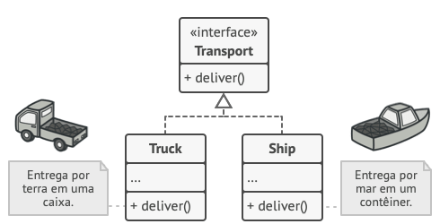

# Factory Method

## 1. Introdução

O Factory Method é um padrão criacional pertencente ao grupo de padrões "GoF", definido no livro "Padrões de Projeto: soluções reutilizáveis de software orientado a objetos". Seu objetivo é reduzir a necessidade de duplicar um pedaço de código quando for necessário criar objetos de classes diferentes, com propriedades semelhantes.

O padrão Factory Method possui os seguintes elementos:
- Criador: declara o método "fábrica", que por sua vez retorna o objeto da classe **Produto**.
- Criador concreto: sobrescreve o método "fábrica", e retorna um objeto da classe **Produto Concreto**.
- Produto: define uma interface para os objetos criados pelo método "fábrica".
- Produto concreto: implementa a interface **Produto**.

O padrão sugere que usemos o método "fábrica" para gerar novos objetos, chamados de "produtos". As subclasses podem alterar a classe dos objetos retornados pelo método fábrica, o que nos permite utilizar o mesmo método para criar objetos de classes diferentes, desde que essas classes herdem de uma classe ou interface em comum. No contexto de um programa de entregas, um exemplo dessa aplicação seria:
- Criador: classe *Logistics*, que define o método "fábrica" *createTransport()*.
- Criadores concretos: *RoadLogistics* e *SeaLogistics*, que sobrescrevem o método "fábrica", que retorna um objeto do tipo *Truck* ou *Ship*, respectivamente.

- Produto: interface *Transport*, que define o tipo dos objetos que serão criados pela "fábrica".
- Produtos concretos: classes *Truck* e *Ship* que implementam a interface *Transport*.

### Pontos positivos
- Baixo acoplamento.
- Torna o programa mais flexível.
### Pontos negativos
- Gera um alto número de classes.
- Pode sobrecarregar o sistema.

## 2. Metodologia

Foi definido em sala que seriam divididos 2 grupos para realizar 1 GoF e 1 GRASP cada, e um terceiro grupo responsável pelo padrão extra.

Na terça-feira (06/06) foi realizada uma reunião com os seguintes membros:
- Caio Vitor
- Lívia Rodrigues
- Vinícius Roriz
- Willdemberg Sales

Durante a qual foi criada a modelagem do padrão GoF. Ficou definido então que os membros Caio Vitor e Willdemberg Sales ficariam responsáveis por implementar o padrão em código, enquanto os restantes fariam o GRASP.

## 3. Factory Method
### 3.1 Aplicação

[Escrever sobre como o padrão se aplica no projeto.]

### 3.2 Modelagem

[Demonstrar uma imagem com a modelagem.]

### 3.3 Código

[Demonstrar o codigo.]

## 4. Histórico de versões

| Versão | Descrição            | Autor           | Revisor             | Data           |
| ------ | -------------------- | --------------- | ------------------- | -------------- |
| 1.0    | Criação do template  | Vinícius Roriz  | Lívia Rodrigues     | 06/06/2023     |
| 1.1    | Adição da seção 1    | Vinícius Roriz  | Lívia Rodrigues     | 06/06/2023     |
| 1.2    | Adição da seção 2    | Vinícius Roriz  | Lívia Rodrigues     | 09/06/2023     |

## 5. Referências bibliográficas

> https://refactoring.guru/design-patterns/factory-method
> https://pt.wikipedia.org/wiki/Factory_Method

