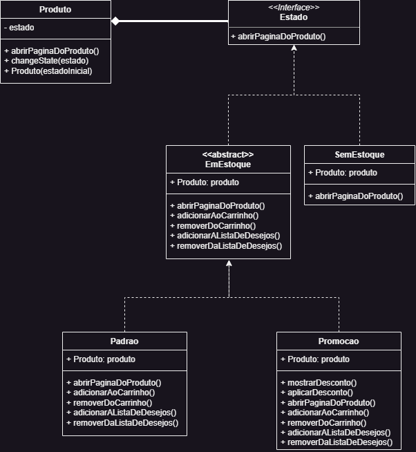
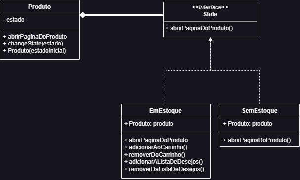

# State

## 1. Introdução

Entre os padrões de projeto descritos no livro GOF, um deles é o padrão State (Estado). O padrão State é um padrão comportamental que permite a um objeto alterar seu comportamento interno quando seu estado interno muda. Ele encapsula estados diferentes como objetos separados e delega o comportamento associado a cada estado para esses objetos. Isso permite que um objeto mude seu comportamento dinamicamente conforme seu estado interno muda, sem a necessidade de lógica condicional complexa.

O padrão State é útil quando um objeto possui diferentes comportamentos ou ações associadas a diferentes estados e precisa alternar entre esses estados durante a execução. Ele promove a coesão e flexibilidade do código, facilitando a adição de novos estados ou a modificação do comportamento existente sem afetar o código existente.

## 2. Metodologia

Para a confecção do State, nos reunimos no discord e criamos um documento na plataforma [draw.io](https://app.diagrams.net/), que permite o trabalho de modelagem em conjunto. Com o auxílio do site [Refactoring Guru](https://refactoring.guru/), modelamos a primeira versão do state, seguindo o modelo disponibilizado no site. Depois, para as versões seguintes, começamos a adaptar a modelagem pensando mais profundamente no site da RiHappy, chegando até a iniciar a implementação do código para melhor entendermos as necessisdades dos objetos e classes.

Por fim, chegamos à modelagem da classe Produto, que é o nosso objeto, e a interface Estado, que seria a classe pai com o método em comum de todos os estados. Herdando de Estado, temos as classes EmEstoque, uma classe abstrata que é dividida em EmPromocao e Padrao, e SemEstoque, que representa um produto indisponível para compra, mas que ainda pode ter suas informações acessadas pelo usuário do site. As classes Padrao e EmPromocao representam um produto disponível para compra, com a diferença de que EmPromocao apresenta os métodos para fazer o cálculo da promoção e mostrár o desconto na interface do usuário.

## 3. State

### Terceira versão da modelagem do GoF - State

### Segunda versão da modelagem do GoF - State

### Primeira versão da modelagem do GoF - State

## 4. Histórico de versões

| Versão | Descrição                             | Autor                              | Revisor           | Data       |
| ------ | ------------------------------------- | ---------------------------------- | ----------------- | ---------- |
| 1.0    | Criação do artefato                   | Matheus Soares & Mateus Caltabiano | Revisor da versão | 09/06/2023 |
| 1.1    | Adição da versão 1 da modelagem State | Matheus Soares & Mateus Caltabiano | Revisor da versão | 09/06/2023 |
| 1.2    | Adição da versão 2 da modelagem State | Matheus Soares & Mateus Caltabiano | Revisor da versão | 09/06/2023 |
| 1.3    | Adição da versão 3 da modelagem State | Matheus Soares & Mateus Caltabiano | Revisor da versão | 09/06/2023 |
| 1.4    | Adição da metodologia                 | Mateus Caltabiano                  |                   | 11/06/2023 |

## 5. Referências bibliográficas

> Refactoring Guru. Design Patterns: State. Disponível em: https://refactoring.guru/design-patterns/state. Acesso em: 07/06/2023.
