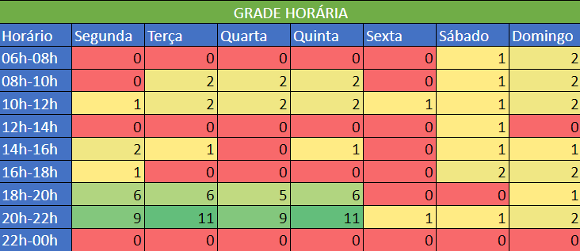

# Heatmap

## 1. Introdução

Heatmap, ou mapa de calor, é uma representação gráfica de dados que utiliza cores para representar diferentes valores ou faixas de valores.

Pode ser utilizado de diversas maneiras, de áreas com maior quantidade de cliques em um site até locais do campo que um jogador mais passou em uma partida de futebol.

No caso do nosso grupo, foi utilizado para verificar os melhores dias e horários da semana para marcar reuniões.

## 2. Metodologia

Para fazer o heatmap, foi criado uma tabela no excel com todos os dias da semana e horários separados de duas em duas horas, das 6 até 22 horas. Cada membro do grupo somou 1 nos horários possíveis para se reunir.

## 3. Heatmap

<figure>
    <figcaption style= "font-size: 12px">Figura 1 - Heatmap do grupo</figcaption>
    
    <figcaption style= "font-size: 12px">Fonte: Grupo 4</figcaption>
</figure>

## 4. Conclusão

Na prática fica claro que ter um heatmap com os horários vagos dos membros da equipe permite verificar a disponibilidade dos mesmos com muito mais rapidez, facilitando a marcação de reuniões, realização de tarefas, pair programming, etc.

## 5. Histórico de versões

| Versão | Descrição             | Autor             | Revisor          | Data       |
| ------ | --------------------- | ----------------- | ---------------- | ---------- |
| 1.0    | Abertura do documento | Mateus Caltabiano | Vinícius Roriz   | 17/04/2023 |

## 6. Referências bibliográficas

> OPTIMIZELY (Nova Iorque) (org.). Heatmap. Disponível em: https://www.optimizely.com/optimization-glossary/heatmap/. Acesso em: 17 abr. 2023.
